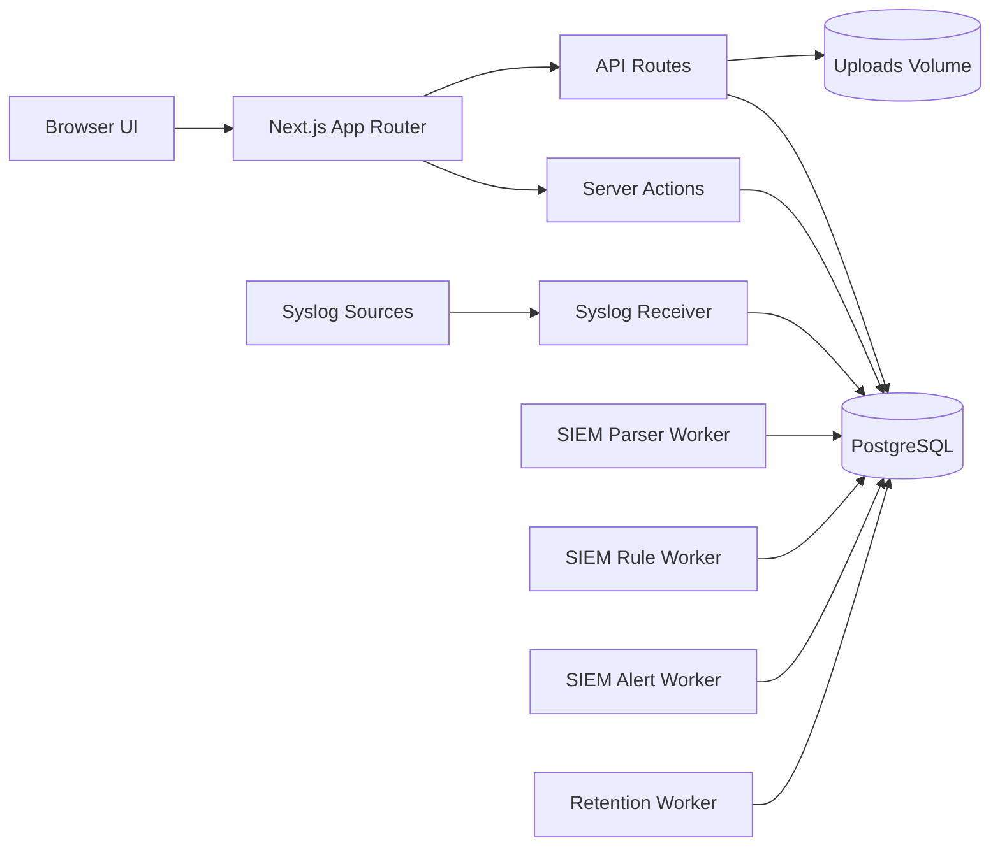

# DataGuard (DC-Check)

<div align="center">

**Open-source data center operations platform for audits, assets, racks, network inventory, SIEM signals, and backup/restore workflows.**

[](https://nextjs.org/)
[](https://react.dev/)
[](https://www.typescriptlang.org/)
[](https://www.postgresql.org/)
[](https://orm.drizzle.team/)
[](LICENSE)

</div>

---

## Why DataGuard exists

Data center operations teams often keep critical records across spreadsheets, photos, chat logs, rack diagrams, and separate monitoring tools. That makes audits slow, handovers fragile, and incident follow-up hard to prove.

**DataGuard** brings those workflows into one multi-site web platform:

- daily equipment audits with evidence photos
- visual rack and device placement
- network ports, VLANs, and connectivity mapping
- reports and exports for compliance review
- SIEM-style syslog ingestion, parsing, findings, and alerts
- in-app backup and restore for production migration and recovery

The project is built as a practical OSS codebase: modular TypeScript, focused server-side libraries, test coverage around critical flows, Docker deployment, and contribution-friendly feature areas.

---

## Feature overview

| Area | What it does |
| --- | --- |
| **Multi-site RBAC** | Superadmin, admin, and staff roles with per-site access controls. |
| **Daily audit checklist** | Shift-based device checks with `OK`, `Warning`, and `Error` states plus photo evidence. |
| **Audit grid** | 7-day matrix view for quick historical health review. |
| **Rack management** | Interactive rack layout with drag-and-drop placement, U-height validation, and collision prevention. |
| **Network inventory** | Device ports, MAC/IP, speed, media type, access/trunk/routed/LACP modes, VLAN assignment, and port-to-port links. |
| **Remote access links** | One-click HTTP, HTTPS, SSH, and Telnet launch helpers for devices with IP addresses. |
| **QR workflows** | QR generation and browser-based QR scanning for fast device lookup. |
| **Reporting** | Excel and PDF exports with date, shift, site, and operator filtering. |
| **Backup & restore** | Superadmin ZIP backup containing PostgreSQL dump plus uploads; restore supports wipe and append modes. |
| **SIEM foundation** | Syslog receiver, parser workers, vendor normalizers, source enrichment, rule engine, findings, retention, and alert workers. |

---

## Architecture



### Core stack

| Layer | Technology |
| --- | --- |
| Framework | Next.js 16 App Router |
| UI | React 19, TypeScript, Tailwind CSS v4, Lucide React |
| Data | PostgreSQL, Drizzle ORM, `pg` |
| Auth | JWT via `jose`, password hashing via `bcryptjs` |
| Validation | Zod |
| Reports | `xlsx`, `jspdf`, `jspdf-autotable` |
| Rack UI | `@dnd-kit` |
| QR | `qrcode`, `html5-qrcode` |
| Backup | `pg_dump`, `pg_restore`, ZIP archives via `archiver` / `unzipper` |
| Runtime | Docker / Docker Compose |

---

## Project structure

```text
dc-check/
├── app/                         # Next.js routes and API handlers
│   ├── (dashboard)/             # Authenticated dashboard pages
│   ├── api/admin/backup/        # Backup download endpoint
│   └── api/admin/restore/       # Restore upload endpoint
├── actions/                     # Server actions for queries and mutations
├── components/                  # Feature UI components
├── db/                          # Drizzle schema and database connection
├── drizzle/                     # Generated migrations
├── lib/
│   ├── backup/                  # Backup, restore, shell runner, locks, env resolution
│   ├── siem/                    # SIEM parsing, rules, normalizers, alerts, retention
│   └── session.ts               # JWT session helpers
├── scripts/                     # Seeds, migrations, SIEM workers, syslog receiver
├── public/uploads/              # Uploaded photos and brand logos
├── Dockerfile                   # Production app image
├── docker-compose.yml           # App, PostgreSQL, and SIEM worker services
└── vitest.config.ts             # Test configuration
```

---

## Quick start

### Prerequisites

- Node.js 20+
- npm
- PostgreSQL 15+ recommended

### Local development

```bash
# 1. Clone
git clone https://github.com/torpedoliar/DataGuard.git
cd DataGuard

# 2. Install dependencies
npm install

# 3. Configure environment
cp .env.example .env
# Edit DATABASE_URL and SESSION_SECRET.
# Generate a strong secret with: openssl rand -base64 32

# 4. Run database migrations and seed data
npm run db:migrate
npm run seed

# 5. Start dev server
npm run dev
```

Open `http://localhost:3000`.

Default seeded account:

```text
Username: admin
Password: password
```

Change the password immediately after first login.

---

## Docker production deployment

The repository includes a Docker Compose setup for the app, PostgreSQL, and SIEM workers.

```bash
# Build and start production services
docker compose up -d --build

# View service status
docker compose ps

# Follow app logs
docker compose logs -f app
```

Main services:

| Service | Purpose |
| --- | --- |
| `app` | Next.js production server on port `3001` |
| `db` | PostgreSQL database on host port `3002` |
| `syslog-receiver` | UDP syslog ingestion on host port `514` |
| `siem-parser` | Raw event parser worker |
| `siem-rules` | Rule evaluation worker |
| `siem-alerts` | Alert delivery worker |
| `siem-retention` | Retention cleanup worker |

> Production note: rotate default credentials and `SESSION_SECRET` before exposing the stack.

---

## Backup and restore

Superadmins can use the in-app **Backup & Restore** page to generate and restore one ZIP archive.

Archive contents:

```text
dump.dump          # PostgreSQL custom-format dump
uploads/           # photos, evidence images, logos, and uploaded assets
```

Restore modes:

- **Wipe & restore** — drops all non-system schemas, recreates `public`, restores the dump, and replaces uploads.
- **Append only** — restores data without deleting existing uploads or schemas; conflicts are reported as errors.

The app pins PostgreSQL 15 client tools for backups so generated dumps remain compatible with the included PostgreSQL 15 server. A PostgreSQL 17 restore fallback is kept for older external backups with newer custom dump headers.

---

## SIEM foundation

DataGuard includes an early SIEM layer designed for data center operations:

- syslog receiver service
- vendor-aware normalizers for generic, MikroTik, Cisco, Fortigate, and Linux logs
- source enrichment and trust levels
- rule engine for single-event, threshold, sequence, absence, and baseline anomaly rules
- findings dashboard and status workflow
- retention worker
- alert worker foundation

This area is intentionally modular, making it a strong place for OSS contributions.

---

## Testing and quality

```bash
# Run all tests
npm test

# Run production build
npm run build

# Run lint
npm run lint
```

The test suite covers critical units such as:

- backup archive generation
- restore preflight and PostgreSQL compatibility paths
- backup locks and environment resolution
- SIEM parsing, source enrichment, retention, redaction, and rule evaluation
- audit action typing
- update scripts and Dockerfile expectations

---

## Why this project fits Codex for OSS

DataGuard has the kind of codebase where AI coding assistance can create real OSS value:

- **Clear modules:** backup/restore, SIEM, rack management, network inventory, reports, and auth are separable.
- **Concrete tests:** critical libraries already have unit tests, making improvements safer.
- **Practical roadmap:** contributors can add normalizers, tests, import/export tools, UI states, docs, and deployment hardening.
- **Real-world domain:** data center operations has many repetitive workflows that benefit from better automation and documentation.
- **Full-stack surface area:** Codex can help across TypeScript UI, server actions, PostgreSQL schema work, Docker, scripts, and tests.

Suggested Codex-friendly contribution areas:

1. Add more SIEM vendor normalizers and fixtures.
2. Improve accessibility and keyboard navigation in rack and admin UIs.
3. Add screenshot-driven documentation and demo data.
4. Expand backup/restore integration tests.
5. Add import flows for network inventory spreadsheets.
6. Harden Docker Compose configuration for public production deployment.
7. Add issue templates and contribution checklists.

---

## Roadmap

- [ ] Public demo screenshots and walkthrough video
- [ ] More syslog vendor normalizers
- [ ] Scheduled backup and retention policy
- [ ] Network inventory import wizard
- [ ] Better dashboard analytics and incident trends
- [ ] Accessibility pass for dashboard components
- [ ] English/Indonesian i18n support
- [ ] GitHub issue templates and contributor guide

---

## Contributing

Contributions are welcome.

Recommended workflow:

1. Fork the repository.
2. Create a feature branch.
3. Keep changes focused and testable.
4. Run `npm test` and `npm run build` before opening a PR.
5. Include screenshots for UI changes.
6. Explain any migration, Docker, or environment changes.

Good first contribution ideas:

- add SIEM parser fixtures
- improve README screenshots once available
- add tests for server actions
- add empty/loading/error states to admin tables
- document production deployment hardening

---

## Security notes

- Change default seeded credentials immediately.
- Use a strong `SESSION_SECRET` with at least 32 characters.
- Rotate Docker Compose sample credentials before production use.
- Run behind HTTPS in production.
- Never commit `.env`, database dumps, or uploaded private files.
- Keep dependencies updated and review `npm audit` output.

---

## License

DataGuard is released under the [MIT License](LICENSE).

---

## Maintainer

Built and maintained by [torpedoliar](https://github.com/torpedoliar).

If you are reviewing this repository for Codex for OSS: the most useful next improvements are better contributor onboarding, richer SIEM fixtures, UI screenshots, and deployment-hardening tasks.
